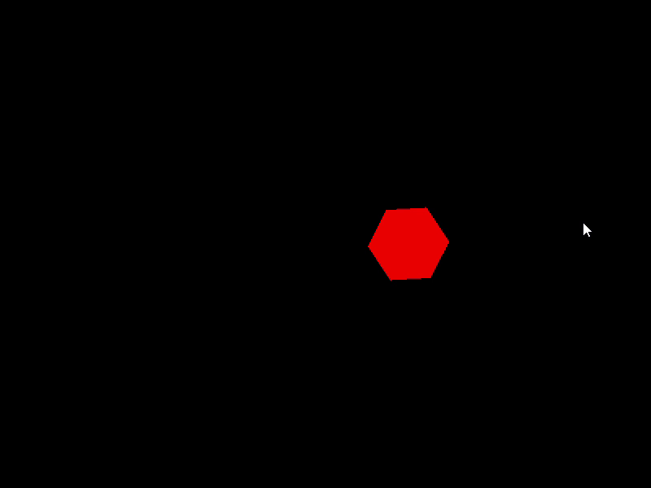

# Python OpenGL Tutorial

## Steps to Get Started: 
### 1. Install Required libraries:
```sh
pip install PyOpenGL PyOpenGL_accelerate pyrr glfw
```

### 2. Clone this Repository:
```sh
git clone --branch pyopengl --single-branch https://github.com/lighterbird/OpenGL_Tutorial.git
```

### 3. Steps to run 
Folder structure: 
```
PyOpenGLTutorial/
├── demo_0/
├── demo_1/
├── demo_2/
├── readme_resources/
└── readme.md
```
Navigate to respective demo folder and run the main python file in it.

## Exercise:
Complete the following tasks (Using codes from demo folders as you wish):

### Tasks
1. Add a uniform called `cameraMatrix` and set it to scale the world co-ordinates from [(-1, -1), (1,1)] to [(-width/2, -height/2), (+width/2, +height/2)]   
2. Take input `n` from the user and create a `n` sided polygon (define its vertices and indices)  
3. Make the polygon rotate and translate from left to right (reversing direction on going out of bounds)

The output should look something like this (for n = 6)  
